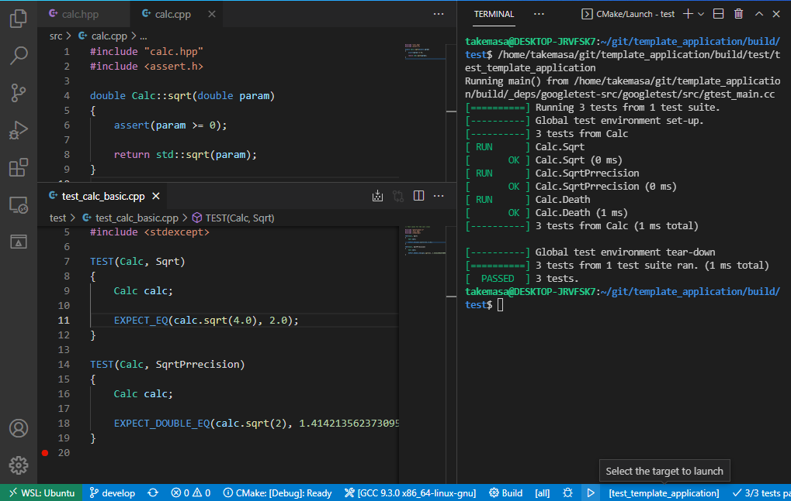

# template_application
A template application for C++ with CMake and GoogleTest
## Description
A CMake file templetes and sample C++ application which allows unit test by GoogleTest. This template application is :
- Able to collaborate with [Visual Studio CODE](https://azure.microsoft.com/ja-jp/products/visual-studio-code/) editor.
- Build in [Google Test](https://github.com/google/googletest) which is downloaded automatically.
- "src" directory for application soruce code.
- "test" directory for unit tests. 
- std::threadh aware. 
- Tested on Ubuntu 20.04  with GCC.
- Tested on Windows 11 with Visual Studio C++ compiler.
- Tested on WSL2 with VS CODE remote server.
## Screenshot

## Requirement
### Ubuntu
- Ubuntu 20.04
- VS Code
- CMake 3.15 or newer
- Python 3
- g++


### Windows
- Windows 10 or 11
- VS Code
- CMake 3.15 or newer
- Python 3
- Microsoft Visual C++ compiler 

### WSL2
- Windows 10 or 11
- VS Code with [Remote Development extention pack](https://marketplace.visualstudio.com/items?itemName=ms-vscode-remote.vscode-remote-extensionpack)
- CMake 3.15 or newer
- Python 3
- g++
- ca-certifications 


## Usage
### Visual Studio CODE
Run the followings commands inside this directory ( Where README.md exists) to start the VS CODE: 
```Shell
code .
```
Inside VS CODE, Type Ctrl-Shift-P to show the command pallet. And then, execute followoing command :
```
CMake: Configure
```
Now, you can build, run the executable and Ctest from the status bar of the VS CODE.


### Command line
Run the followings commands inside this directory ( Where README.md exists) : 
```Shell
mkdir build
cd build
cmake ..
cmake --build .
```
The executables are stored in the subdirectories: 
- build/src
- build/test

In the case of MS Visual Studio C, the executables are located under the build configuration subidirectories like :
- build/src/Debug, build/src/Release
- build/test/Debug, build/test/Release

To run the Ctest, type :
```Shell
ctest
```

## Install
 
### Ubuntu
Run followings on the shell. 
```Shell
sudo snap install vscode --classic
sudo apt-get install build-essential cmake
```
- Note 1: After installing VS CODE, install the [C++ Extention Pack](https://marketplace.visualstudio.com/items?itemName=ms-vscode.cpptools-extension-pack) to the VS CODE.
### Windows

Run followings on the PowerShell or Command . 
```PowerShell
winget install Microsoft.VisualStudioCode -e
winget install Kitware.CMake -e
winget install Microsoft.VisualStudio.2022.Community -e
winget install Git.Git -e
winget install Python.Python.3 -e
```
- Note 1: After installing VS CODE, install the [C++ Extention Pack](https://marketplace.visualstudio.com/items?itemName=ms-vscode.cpptools-extension-pack) to the VS CODE.
- Note 2: The above winget install the CMake installer only. Run the CMake once and complete the installation.
- Note 3: The above wget install the VisualStudio launcher only. [Install the C++ worload](https://docs.microsoft.com/en-us/cpp/build/vscpp-step-0-installation?view=msvc-170) after winget installation.

After the installation, set the PATH environment variable for CMake, Visual Studio C and Git. 

### WSL2

Run followings on the PowerShell or Command to install the Visual Studio CODE editor. 
```PowerShell
winget install Microsoft.VisualStudioCode -e
```
Then, run followings on the Ubuntu shell. 
```Shell
sudo apt-get install build-essential cmake ca-certifications
```
- Note 1: After installing VS CODE, install the [C++ Extention Pack](https://marketplace.visualstudio.com/items?itemName=ms-vscode.cpptools-extension-pack) to the VS CODE.
- Note 2: The VS CODE is installed in the Windows side and accessed from WSL as remote server. Refer the [explanation by Microsoft](https://docs.microsoft.com/en-us/windows/wsl/tutorials/wsl-vscode) and install the Remote Development extention pack.

## License
This project is shared with the [MIT License](LICENSE). 